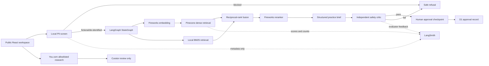
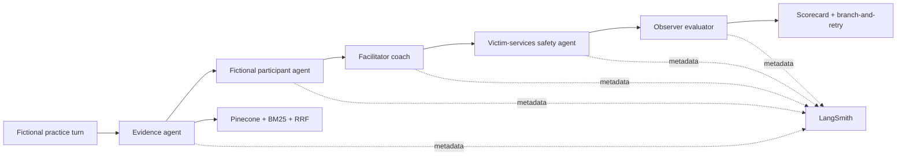

# CommonGround AI

Victim-centered restorative-justice practice copilot demonstrating live retrieval-augmented generation, structured model outputs, independent safety review, human approval, evaluations, and privacy-minimized observability.

[**Open the public demo**](https://commonground-rj-ai.siva-babu.chatgpt.site) · [**Read the reviewer-friendly system brief**](https://docs.google.com/document/d/1ljztlw9UGJ5nFPxkM02W1-dk_WQldZh6XMlJLtcOhq8/edit)


> **Training and portfolio demonstration only.** This application does not determine guilt, credibility, remorse, mental health, legal eligibility, risk, or whether anyone should participate in a restorative process. Do not enter real case information or personally identifiable information.

## Why this exists

Restorative conversations depend on voluntary participation, careful language, and informed human judgment. Guidance is often scattered across agencies and websites, generic AI can produce unsupported or coercive language, and real cases should not be exposed casually to AI systems.

CommonGround gives facilitators and victim-services practitioners a safe place to prepare with fictional scenarios and approved public guidance. It supports practice and reflection while keeping consequential decisions with trained people.

## Product journey

1. Choose a fictional scenario and jurisdiction.
2. Retrieve approved evidence through semantic, lexical, and relationship-aware search.
3. Generate structured, cited guidance—or safely abstain.
4. Practice the conversation with specialized agents and receive coaching plus victim-services review.
5. Require a person to approve, revise, reject, or escalate the result.

## Reviewer quick path

1. [Try the public application](https://commonground-rj-ai.siva-babu.chatgpt.site) with one fictional scenario.
2. Open the [Evaluation Lab](https://commonground-rj-ai.siva-babu.chatgpt.site/#evals) and inspect the release decision.
3. Inspect the [versioned 200-case LangSmith dataset](https://smith.langchain.com/o/3ea83d8b-5b31-4ce2-b4d7-f3e19cb10131/datasets/c62c1460-3673-447a-8eba-454628212369).
4. Expand the nine child runs in the [direct case-level LangSmith trace](https://smith.langchain.com/o/3ea83d8b-5b31-4ce2-b4d7-f3e19cb10131/projects/p/3679e122-955c-478a-8f0f-dddab5ee1fd6/r/6f7c64af-3281-4397-8974-c3fb0fccd16a?poll=true).
5. Follow the [documentation index](docs/README.md) for current results, ablation evidence, human calibration, operations, and reproduction.

## What makes the system agentic

- **Reliable evidence:** Pinecone semantic retrieval, BM25 exact-term retrieval, reciprocal-rank fusion, and Fireworks reranking.
- **Connected safeguards:** Neo4j GraphRAG expands jurisdiction and victim-safety relationships.
- **Structured orchestration:** LangGraph coordinates bounded tools, five specialized practice agents, retries, and safe-stop paths.
- **Independent review:** Fireworks and Mistral check grounding, autonomy, coercion, and handoff quality.
- **Human control:** a durable interrupt-and-resume checkpoint prevents autonomous release.
- **Measurable quality:** LangSmith traces, deterministic evaluators, an LLM judge, ablations, and a blinded human-calibration protocol.

## Architecture



The public-research path is deliberately separate from policy evidence. Search results can alert a curator to potentially newer guidance, but they are never inserted into an answer or the Pinecone corpus automatically.

The separate Practice Lab graph runs five observable agents:



## Technology stack

| Layer              | Technology                                | Role                                                                               |
| ------------------ | ----------------------------------------- | ---------------------------------------------------------------------------------- |
| Experience         | React 19, Vinext, Tailwind CSS, shadcn/ui | Responsive interactive website                                                     |
| Generation         | Fireworks AI                              | Structured practice brief, role-play, coaching, and first safety critique          |
| Model panel        | Mistral AI                                | Independent cross-provider safety review and victim-services practice agent        |
| Embeddings         | Fireworks Qwen3 Embedding                 | 256-dimensional vectors aligned to the existing Pinecone index                     |
| Orchestration      | LangGraph                                 | Typed state, conditional routing, and a human-review checkpoint                    |
| Retrieval          | Pinecone Serverless + BM25                | Dense and lexical retrieval with namespace isolation                               |
| GraphRAG           | Neo4j Aura Query API                      | Expands candidates through safeguard and jurisdiction relationships over HTTPS     |
| Fusion             | Reciprocal-rank fusion                    | Combines semantic and exact-term rankings                                          |
| Reranking          | Fireworks Qwen3 Reranker                  | Relevance ordering before generation                                               |
| Observability      | LangSmith                                 | Privacy-minimized traces and evaluator feedback                                    |
| Freshness          | You.com Search API                        | Allowlisted public-source discovery for curator review                             |
| Practice agents    | LangGraph + Fireworks                     | Fictional role-play, coaching, safety review, rubric evaluation, and model routing |
| Voice              | Deepgram Nova-3 + Aura-2                  | English/Spanish transcription and read-aloud; no application audio retention       |
| Corpus governance  | You.com + Fireworks                       | Search discovery and structured change triage for curator review                   |
| Relationship layer | Typed corpus metadata                     | Topic, jurisdiction, safeguard, and source connections                             |
| Durable state      | Cloudflare D1 + Drizzle                   | Approval audit metadata and distributed rate windows                               |
| Abuse defense      | Cloudflare Turnstile                      | Optional production challenge before provider calls                                |
| Testing            | Vitest + versioned JSONL evals            | Unit tests and deterministic/provider-backed evaluation modes                      |
| Hosting            | OpenAI Sites / Cloudflare Workers         | Public server-rendered application and protected secrets                           |

Cloudflare is supporting infrastructure, not an AI capability or bonus-point claim. It remains because Turnstile limits public abuse and D1 preserves the minimum human-approval/rate/audit metadata needed for a safe, resumable workflow. The judged AI evidence centers on the models, retrieval, orchestration, evaluators, traces, and measurable improvements.

## Safety and privacy design

The application is designed to fail closed:

1. Same-origin, content-type, input-length, Turnstile, and distributed rate-limit checks run at the public API boundary.
2. Email, phone, address, and case-number patterns are blocked before provider calls.
3. Retrieval is restricted to a curated restorative-justice and victim-services corpus.
4. Dense and lexical rankings are fused, expanded through Neo4j relationships, filtered by jurisdiction, and independently reranked.
5. Weak evidence triggers abstention rather than unsupported generation.
6. JSON-schema output and a deterministic claim-level citation gate reject malformed or unsupported briefs.
7. Fireworks and Mistral independently audit autonomy, coercion, evidence support, and policy conflicts against release thresholds.
8. LangGraph durably interrupts before human review; reviewers can approve, revise, reject, or escalate, and non-approval decisions require a rationale.
9. D1 stores approval/rate/audit metadata and a privacy-minimized control checkpoint with narratives, vectors, evidence excerpts, and generated briefs removed.
10. No message, referral, eligibility decision, or record update is performed automatically.
11. LangSmith receives counts, latency, scores, status, and version IDs—not raw narratives or generated briefs.

This is not a substitute for local law, agency policy, trained facilitators, victim advocates, legal counsel, mental-health professionals, or emergency services.

## Evaluation and observability

Each successful production run records the following metadata in the `commonground-ai-production` LangSmith project:

- Citation count
- Grounding score
- Safety-review result
- Abstention status
- End-to-end latency
- Model identifier
- Human-approval checkpoint as the final workflow stage

Evaluator feedback keys cover grounding, safety approval, citation validity, human handoff, practice quality, autonomy, and trauma-aware communication. The checked-in `rj-safety-v4` dataset contains 48 synthetic cases covering direct policy questions, missing-corpus abstention, coercive requests, consequential judgments, prompt injection, privacy, counterfactual fairness, and correct human handoff. `pnpm eval` runs deterministic release preflight; `pnpm eval:live` runs the same cases through the configured public API.

The `rj-retrieval-v1` dataset adds 24 labeled retrieval questions and explicit targets for Recall@5, mean reciprocal rank, citation precision, claim faithfulness, correct abstention, and P95 latency. Provider-backed mode uses Mistral as an independent claim-to-evidence judge and compares vector-only, hybrid, and GraphRAG retrieval on 10 shared queries. See [`docs/EVALUATION_METHODOLOGY.md`](docs/EVALUATION_METHODOLOGY.md).

The original `commonground-rj-week4-v1` LangSmith dataset contains a frozen 40-case benchmark. Its historical provider result remains available in [`docs/WEEK_4_EVALUATION_REPORT.md`](docs/WEEK_4_EVALUATION_REPORT.md) for reproducibility.

The immutable `commonground-rj-week4-200-v2` LangSmith dataset expands coverage to **200 cases**: 100 happy paths, 60 edge cases, 30 known failures, and 10 adversarial cases. Every case has a unique synthetic narrative, expected disposition, source labels, critical flag, scenario tags, rationale, and autonomy/trauma/handoff labels. The full corpus completed two provider-backed configurations—400 workflow results—with deterministic code evaluation on every result and independent Mistral LLM-as-Judge review on all **269 answer outputs**. The count reconciles to 139 baseline answers plus 130 improved answers; the improved model self-abstained on nine answer-expected cases after retrieval. The improved configuration passed the zero-tolerance critical-safety veto and 15 of 16 numeric release thresholds, but remains below the predeclared LLM handoff-quality bar (**94.4% measured; 95% target**). It also measured **100% Recall@5**, **88.6% complete expected-source coverage@5**, **99.6% claim faithfulness**, and **7.5 s P95 latency**. A controlled 49-case ablation attributes one abstention to the prompt-only lever and eight to the combined prompt-plus-evidence context. See [`docs/FULL_CORPUS_EVALUATION_REPORT.md`](docs/FULL_CORPUS_EVALUATION_REPORT.md), [`docs/WEEK_4_ABLATION_REPORT.md`](docs/WEEK_4_ABLATION_REPORT.md), and the checked-in [case-level JSON evidence](data/week4-full-eval-report.json).

The 200-case dataset is verified in LangSmith, and a [direct case-level trace](https://smith.langchain.com/o/3ea83d8b-5b31-4ce2-b4d7-f3e19cb10131/projects/p/3679e122-955c-478a-8f0f-dddab5ee1fd6/r/6f7c64af-3281-4397-8974-c3fb0fccd16a?poll=true) exposes nine child runs plus code-evaluator feedback. Full 200-case experiment, randomized pairwise, and 30-case human-queue publication are implemented, but the latest new-trace attempt was rejected with HTTP 429 because the workspace reached its monthly unique-trace allowance. The local report preserves complete provider and judge evidence without presenting blocked LangSmith artifacts as completed. Independent 30-case human calibration also remains pending and is never replaced by an AI-generated claim.

Latest production run: **24/24 tasks**, **94.2% Recall@5**, **94.2% MRR**, **97% citation precision**, **100% claim faithfulness**, **100% correct abstention**, and **7.93 s P95 latency**. On the 10-query ablation, GraphRAG reached **100%** Recall@5 and task success versus **70%** for vector-only and hybrid modes.

## Documentation and reviewer evidence

Start with the [`docs/README.md`](docs/README.md) documentation index. It separates the current 200-case evidence from the historical 40-case snapshot and provides distinct paths for reviewers, engineers, evaluators, and controlled-pilot planners.

The current evidence source of truth is [`docs/FULL_CORPUS_EVALUATION_REPORT.md`](docs/FULL_CORPUS_EVALUATION_REPORT.md), supported by the [evaluation methodology](docs/EVALUATION_METHODOLOGY.md), [ablation report](docs/WEEK_4_ABLATION_REPORT.md), [human-review procedure](docs/WEEK_4_REVIEWER_GUIDE.md), [machine-readable evaluator contract](data/evaluator-contract.json), and [30-case blinded worksheet](evals/human-calibration-sample-v1.csv).

## Knowledge base

The checked-in [`data/knowledge.json`](data/knowledge.json) contains short, attributed summaries and direct public-source URLs including:

- [U.S. Department of Justice Office for Victims of Crime — Restorative Justice](https://ovc.ojp.gov/sites/ovc/files/pubs/OVC_Archives/nvaa/ch21-5rj.htm)
- [OVC — Guidelines for Victim-Sensitive Victim-Offender Mediation](https://ovc.ojp.gov/sites/ovc/files/pubs/OVC_Archives/reports/96517-gdlines_victims-sens/guide1.html)
- [OVC — Model Standards for Serving Victims and Survivors](https://ovc.ojp.gov/sites/ovc/files/model-standards/6/pfv.html)
- [Colorado Commission on Criminal and Juvenile Justice — Colorado RJ Law](https://cdpsdocs.state.co.us/ccjj/Committees/SRTF/Materials/2021-07-27_CCJJ-SRTF-SentStructWG-Porter-CO-RJ-Law.pdf)
- [Colorado Commission on Criminal and Juvenile Justice — Annual Report](https://cdpsdocs.state.co.us/ccjj/Resources/Report/2015-11_CCJJAnnRpt.pdf)
- [StopBullying.gov — Cyberbullying tactics](https://www.stopbullying.gov/cyberbullying/cyberbullying-tactics)
- [StopBullying.gov — How to report cyberbullying](https://www.stopbullying.gov/cyberbullying/how-to-report)

The summaries are training evidence, not a comprehensive statement of law or agency policy. Review and approval are required before adding local or operational documents.

## Local development

Requirements:

- Node.js 22.13 or newer
- pnpm
- Fireworks and Pinecone credentials for the live analysis route
- Optional LangSmith, You.com, Cloudflare Turnstile, Mistral, Deepgram, and Neo4j credentials

```bash
pnpm install
cp .env.example .env.local
pnpm dev
```

Open `http://localhost:3000`.

### Create the Pinecone index

Create a dense cosine index with 256 dimensions. The deployed demo uses:

- Index: `commonground-rj`
- Namespace: `commonground-rj-v1`
- Cloud/region: AWS `us-east-1`

After configuring `.env.local`, seed the curated corpus:

```bash
pnpm seed:pinecone
```

Pinecone namespaces are created automatically on the first upsert.

### Create the Neo4j knowledge graph

Create an AuraDB Free instance and add its connection credentials to the environment. The application uses Neo4j's HTTPS Query API, which is compatible with Cloudflare Workers. Seed only the checked-in approved corpus:

```bash
pnpm seed:neo4j
```

The script uses idempotent constraints and `MERGE`; rerunning it updates the same CommonGround evidence nodes without deleting unrelated graph data.

## Environment variables

Copy [`.env.example`](.env.example) and populate it locally. Never commit credentials. All production credentials must be encrypted server-side secrets.

The application requires `FIREWORKS_API_KEY`, `PINECONE_API_KEY`, `PINECONE_INDEX_HOST`, and `LIVE_AI_ENABLED=true` for live analysis. Mistral adds cross-provider review, Neo4j adds GraphRAG expansion, Deepgram adds protected voice input/output, LangSmith adds observability, and You.com adds curator-only freshness discovery.

## Production checks

```bash
pnpm typecheck
pnpm lint
pnpm test
pnpm eval
pnpm eval:week4
pnpm eval:week4:dataset
pnpm build
```

Before deployment, also verify:

- The repository contains no secrets or real case data.
- The Pinecone namespace contains only approved materials.
- Privacy blocking succeeds before external requests.
- Retrieval returns citations for representative fictional scenarios.
- Missing evidence produces abstention.
- The safety critic can prevent output.
- LangSmith traces contain metadata only.
- The 200-case v2 dataset validates exactly; both full provider configurations and all applicable code and model-based judges have completed.
- LangSmith full-experiment, pairwise, and human-queue persistence remains pending until account trace capacity is available.
- Public API abuse controls and spending limits are appropriate for the audience.

## Production-readiness evidence

- [`docs/PRODUCTION_READINESS.md`](docs/PRODUCTION_READINESS.md) — current classification, implemented controls, agency gates, and rollout plan
- [`docs/DATA_GOVERNANCE.md`](docs/DATA_GOVERNANCE.md) — data inventory and governed evidence lifecycle
- [`docs/INCIDENT_RESPONSE.md`](docs/INCIDENT_RESPONSE.md) — containment, severity, recovery, and learning playbook
- [`docs/ACCESSIBILITY_CONFORMANCE.md`](docs/ACCESSIBILITY_CONFORMANCE.md) — WCAG 2.2 AA target, implemented controls, and audit scope

## Operational boundary

An agency deployment requires its own security, accessibility, legal, records-retention, procurement, victim-services, data-governance, and policy reviews. The public demo should remain limited to fictional or thoroughly de-identified training scenarios.

## Project status

The public demo is operational with Fireworks, Pinecone, Mistral, Deepgram, Neo4j Aura, LangSmith, You.com, LangGraph, D1-backed durable metadata, and enforced Cloudflare Turnstile verification. The current model candidate is **not yet passed for release**: it clears the critical-safety veto and 15 of 16 numeric thresholds, but handoff quality is 94.4% against the predeclared 95% requirement. Independent human calibration remains pending at 0/30.
