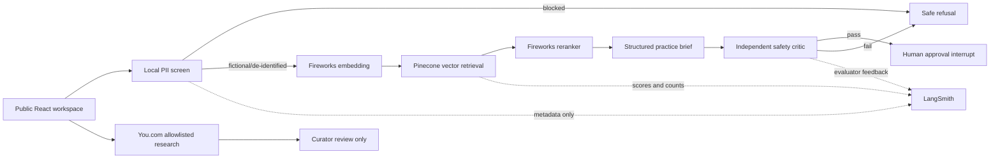

# CommonGround AI

Victim-centered restorative-justice practice copilot demonstrating live retrieval-augmented generation, structured model outputs, independent safety review, human approval, evaluations, and privacy-minimized observability.

[**Open the public demo**](https://commonground-rj-ai.siva-babu.chatgpt.site)


> **Training and portfolio demonstration only.** This application does not determine guilt, credibility, remorse, mental health, legal eligibility, risk, or whether anyone should participate in a restorative process. Do not enter real case information or personally identifiable information.

## What the demo shows

- A public, accessible case workspace with three fictional scenarios
- Deterministic privacy screening before external AI calls
- Fireworks Qwen3 embeddings, reranking, and JSON-schema-constrained generation
- A dedicated, deletion-protected Pinecone index and isolated namespace
- A second Fireworks call acting as an independent safety critic
- Source-linked evidence, groundedness signals, abstention, and required human approval
- Metadata-only LangSmith production traces and evaluator feedback
- You.com freshness research restricted to authoritative public domains
- Evaluation views covering retrieval, citations, refusals, safety, and human handoffs

## Architecture



The public-research path is deliberately separate from policy evidence. Search results can alert a curator to potentially newer guidance, but they are never inserted into an answer or the Pinecone corpus automatically.

## Technology stack

| Layer | Technology | Role |
|---|---|---|
| Experience | React 19, Vinext, Tailwind CSS, shadcn/ui | Responsive interactive website |
| Generation | Fireworks AI | Structured practice brief and independent safety critique |
| Embeddings | Fireworks Qwen3 Embedding | 1,024-dimensional vectors |
| Retrieval | Pinecone Serverless | Dedicated cosine index, namespace isolation, metadata |
| Reranking | Fireworks Qwen3 Reranker | Relevance ordering before generation |
| Observability | LangSmith | Privacy-minimized traces and evaluator feedback |
| Freshness | You.com Search API | Allowlisted public-source discovery for curator review |
| Hosting | OpenAI Sites / Cloudflare Workers | Public server-rendered application and protected secrets |

## Safety and privacy design

The application is designed to fail closed:

1. Input length and rate limits run at the public API boundary.
2. Email, phone, address, and case-number patterns are blocked before provider calls.
3. Retrieval is restricted to a curated restorative-justice and victim-services corpus.
4. Empty retrieval triggers abstention rather than unsupported generation.
5. The generation prompt prohibits consequential person-level judgments.
6. A separate model audits coercion, victim blaming, unsupported claims, and policy conflicts.
7. No message, referral, eligibility decision, or record update is performed automatically.
8. LangSmith receives character counts, latency, scores, and status—not raw narratives or generated briefs.

This is not a substitute for local law, agency policy, trained facilitators, victim advocates, legal counsel, mental-health professionals, or emergency services.

## Evaluation and observability

Each successful production run records the following metadata in the `commonground-ai-production` LangSmith project:

- Citation count
- Grounding score
- Safety-review result
- Abstention status
- End-to-end latency
- Model identifier
- Human-approval interrupt as the final workflow stage

Evaluator feedback keys are `grounding`, `safety_approved`, and `has_citations`. The interface also demonstrates a versioned 40-case offline evaluation suite covering direct policy questions, multi-document synthesis, missing-corpus abstention, coercive requests, prompt injection, privacy, and correct human handoff.

## Knowledge base

The checked-in [`data/knowledge.json`](data/knowledge.json) contains short, attributed summaries and source URLs from public materials including:

- U.S. Department of Justice Office for Victims of Crime
- Colorado Commission on Criminal and Juvenile Justice
- Colorado public-safety materials
- StopBullying.gov

The summaries are training evidence, not a comprehensive statement of law or agency policy. Review and approval are required before adding local or operational documents.

## Local development

Requirements:

- Node.js 22.13 or newer
- pnpm
- Fireworks and Pinecone credentials for the live analysis route
- Optional LangSmith and You.com credentials

```bash
pnpm install
cp .env.example .env.local
pnpm dev
```

Open `http://localhost:3000`.

### Create the Pinecone index

Create a dense cosine index with 1,024 dimensions. The deployed demo uses:

- Index: `commonground-rj`
- Namespace: `commonground-rj-v1`
- Cloud/region: AWS `us-east-1`

After configuring `.env.local`, seed the curated corpus:

```bash
pnpm seed:pinecone
```

Pinecone namespaces are created automatically on the first upsert.

## Environment variables

Copy [`.env.example`](.env.example) and populate it locally. Never commit credentials. All production credentials must be encrypted server-side secrets.

The application requires `FIREWORKS_API_KEY`, `PINECONE_API_KEY`, `PINECONE_INDEX_HOST`, and `LIVE_AI_ENABLED=true` for live analysis. LangSmith and You.com are optional integrations.

## Production checks

```bash
pnpm build
```

Before deployment, also verify:

- The repository contains no secrets or real case data.
- The Pinecone namespace contains only approved materials.
- Privacy blocking succeeds before external requests.
- Retrieval returns citations for representative fictional scenarios.
- Missing evidence produces abstention.
- The safety critic can prevent output.
- LangSmith traces contain metadata only.
- Public API abuse controls and spending limits are appropriate for the audience.

## Operational boundary

An agency deployment requires its own security, accessibility, legal, records-retention, procurement, victim-services, data-governance, and policy reviews. The public demo should remain limited to fictional or thoroughly de-identified training scenarios.

## Project status

The live demo is operational with Fireworks, Pinecone, LangSmith, and You.com. Cloudflare Turnstile or equivalent distributed abuse protection is recommended before promoting unrestricted public use.
