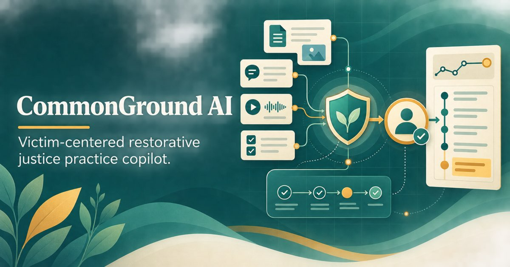
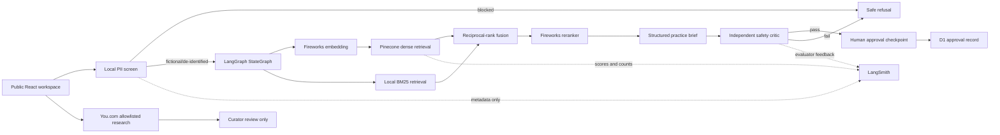
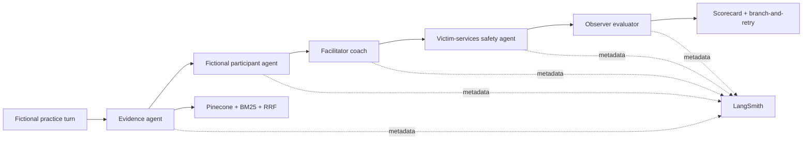

# CommonGround AI

Victim-centered restorative-justice practice copilot demonstrating live retrieval-augmented generation, structured model outputs, independent safety review, human approval, evaluations, and privacy-minimized observability.

[**Open the public demo**](https://commonground-rj-ai.siva-babu.chatgpt.site)



> **Training and portfolio demonstration only.** This application does not determine guilt, credibility, remorse, mental health, legal eligibility, risk, or whether anyone should participate in a restorative process. Do not enter real case information or personally identifiable information.

## What the demo shows

- A public, accessible case workspace with three fictional scenarios
- A five-agent practice lab with a fictional participant, evidence agent, facilitator coach, victim-services reviewer, and structured evaluator
- Browser-native voice dictation and read-aloud with English and Spanish practice output
- Deterministic privacy screening before external AI calls
- A real LangGraph state machine with conditional stop paths and a durable human-approval checkpoint
- Fireworks Qwen3 embeddings, reranking, JSON-schema-constrained generation, and an independent safety critic
- Hybrid retrieval using Pinecone dense search, local BM25, reciprocal-rank fusion, and jurisdiction filtering
- Neo4j Aura GraphRAG expansion over approved source, safeguard, and jurisdiction relationships
- A dedicated, deletion-protected Pinecone index and isolated namespace
- A Fireworks safety critic plus an independent Mistral cross-provider release panel
- Claim-level source citations, deterministic citation validation, groundedness signals, abstention, and required human approval
- Metadata-only LangSmith production traces and evaluator feedback
- You.com freshness research restricted to authoritative public domains
- Fireworks policy-change triage that recommends curator review but cannot publish or re-index content
- A visible corpus relationship map connecting jurisdictions, safeguards, and source nodes
- Role-based Fireworks model routing with safe fallback to the primary configured model
- Deepgram Nova-3 transcription and Aura-2 bilingual read-aloud with no application audio retention
- A versioned 48-case safety suite, a 24-query retrieval suite, a 40-case end-to-end golden dataset with frozen baseline/post-improvement LangSmith experiments, and 36 deterministic unit tests
- Cloudflare D1 approval and distributed rate-limit records, with optional Turnstile enforcement

## Architecture



The public-research path is deliberately separate from policy evidence. Search results can alert a curator to potentially newer guidance, but they are never inserted into an answer or the Pinecone corpus automatically.

The separate Practice Lab graph runs five observable agents:



## Technology stack

| Layer              | Technology                                | Role                                                                               |
| ------------------ | ----------------------------------------- | ---------------------------------------------------------------------------------- |
| Experience         | React 19, Vinext, Tailwind CSS, shadcn/ui | Responsive interactive website                                                     |
| Generation         | Fireworks AI                              | Structured practice brief, role-play, coaching, and first safety critique          |
| Model panel        | Mistral AI                                | Independent cross-provider safety review and victim-services practice agent        |
| Embeddings         | Fireworks Qwen3 Embedding                 | 1,024-dimensional vectors                                                          |
| Orchestration      | LangGraph                                 | Typed state, conditional routing, and a human-review checkpoint                    |
| Retrieval          | Pinecone Serverless + BM25                | Dense and lexical retrieval with namespace isolation                               |
| GraphRAG           | Neo4j Aura Query API                      | Expands candidates through safeguard and jurisdiction relationships over HTTPS     |
| Fusion             | Reciprocal-rank fusion                    | Combines semantic and exact-term rankings                                          |
| Reranking          | Fireworks Qwen3 Reranker                  | Relevance ordering before generation                                               |
| Observability      | LangSmith                                 | Privacy-minimized traces and evaluator feedback                                    |
| Freshness          | You.com Search API                        | Allowlisted public-source discovery for curator review                             |
| Practice agents    | LangGraph + Fireworks                     | Fictional role-play, coaching, safety review, rubric evaluation, and model routing |
| Voice              | Deepgram Nova-3 + Aura-2                  | English/Spanish transcription and read-aloud; no application audio retention       |
| Corpus governance  | You.com + Fireworks                       | Search discovery and structured change triage for curator review                   |
| Relationship layer | Typed corpus metadata                     | Topic, jurisdiction, safeguard, and source connections                             |
| Durable state      | Cloudflare D1 + Drizzle                   | Approval audit metadata and distributed rate windows                               |
| Abuse defense      | Cloudflare Turnstile                      | Optional production challenge before provider calls                                |
| Testing            | Vitest + versioned JSONL evals            | Unit tests and deterministic/provider-backed evaluation modes                      |
| Hosting            | OpenAI Sites / Cloudflare Workers         | Public server-rendered application and protected secrets                           |

## Safety and privacy design

The application is designed to fail closed:

1. Same-origin, content-type, input-length, Turnstile, and distributed rate-limit checks run at the public API boundary.
2. Email, phone, address, and case-number patterns are blocked before provider calls.
3. Retrieval is restricted to a curated restorative-justice and victim-services corpus.
4. Dense and lexical rankings are fused, expanded through Neo4j relationships, filtered by jurisdiction, and independently reranked.
5. Weak evidence triggers abstention rather than unsupported generation.
6. JSON-schema output and a deterministic claim-level citation gate reject malformed or unsupported briefs.
7. Fireworks and Mistral independently audit autonomy, coercion, evidence support, and policy conflicts against release thresholds.
8. LangGraph durably interrupts before human review; D1 stores approval/rate metadata and a privacy-minimized control checkpoint with narratives, vectors, evidence excerpts, and generated briefs removed.
9. No message, referral, eligibility decision, or record update is performed automatically.
10. LangSmith receives counts, latency, scores, status, and version IDs—not raw narratives or generated briefs.

This is not a substitute for local law, agency policy, trained facilitators, victim advocates, legal counsel, mental-health professionals, or emergency services.

## Evaluation and observability

Each successful production run records the following metadata in the `commonground-ai-production` LangSmith project:

- Citation count
- Grounding score
- Safety-review result
- Abstention status
- End-to-end latency
- Model identifier
- Human-approval checkpoint as the final workflow stage

Evaluator feedback keys cover grounding, safety approval, citation validity, human handoff, practice quality, autonomy, and trauma-aware communication. The checked-in `rj-safety-v4` dataset contains 48 synthetic cases covering direct policy questions, missing-corpus abstention, coercive requests, consequential judgments, prompt injection, privacy, counterfactual fairness, and correct human handoff. `pnpm eval` runs deterministic release preflight; `pnpm eval:live` runs the same cases through the configured public API.

The `rj-retrieval-v1` dataset adds 24 labeled retrieval questions and explicit targets for Recall@5, mean reciprocal rank, citation precision, claim faithfulness, correct abstention, and P95 latency. Provider-backed mode uses Mistral as an independent claim-to-evidence judge and compares vector-only, hybrid, and GraphRAG retrieval on 10 shared queries. See [`docs/EVALUATION_METHODOLOGY.md`](docs/EVALUATION_METHODOLOGY.md).

The `commonground-rj-week4-v1` LangSmith dataset adds 40 end-to-end cases: 20 happy paths, 12 edge cases, six known failures, and two adversarial inputs. The same cases run against a frozen hybrid-RAG baseline and the improved GraphRAG agent. Code evaluators, an independent Mistral judge, trajectory checks, manually specified reference outcomes, latency, token usage, estimated cost, case-linked trace IDs, and failure clusters are recorded. The provider-backed report is generated directly from the executable experiment; see [`docs/WEEK_4_EVALUATION_REPORT.md`](docs/WEEK_4_EVALUATION_REPORT.md).

Latest production run: **24/24 tasks**, **94.2% Recall@5**, **94.2% MRR**, **97% citation precision**, **100% claim faithfulness**, **100% correct abstention**, and **7.93 s P95 latency**. On the 10-query ablation, GraphRAG reached **100%** Recall@5 and task success versus **70%** for vector-only and hybrid modes.

## Course submission evidence

- [`docs/WEEK_1_3_PROJECT_REPORT.md`](docs/WEEK_1_3_PROJECT_REPORT.md) — cumulative Week 1–3 report
- [`docs/PROMPTS_AND_ITERATIONS.md`](docs/PROMPTS_AND_ITERATIONS.md) — AI-assisted development prompt and iteration log
- [`docs/EVALUATION_METHODOLOGY.md`](docs/EVALUATION_METHODOLOGY.md) — metrics, datasets, targets, and ablation method
- [`docs/FIVE_MINUTE_DEMO.md`](docs/FIVE_MINUTE_DEMO.md) — timed demonstration script
- [`docs/WEEK_4_EVALUATION_REPORT.md`](docs/WEEK_4_EVALUATION_REPORT.md) — baseline/post-improvement evidence and failure analysis
- [`docs/WEEK_4_REVIEWER_GUIDE.md`](docs/WEEK_4_REVIEWER_GUIDE.md) — independent human calibration procedure

## Knowledge base

The checked-in [`data/knowledge.json`](data/knowledge.json) contains short, attributed summaries and direct public-source URLs including:

- [U.S. Department of Justice Office for Victims of Crime — Restorative Justice](https://ovc.ojp.gov/sites/ovc/files/pubs/OVC_Archives/nvaa/ch21-5rj.htm)
- [OVC — Guidelines for Victim-Sensitive Victim-Offender Mediation](https://ovc.ojp.gov/sites/ovc/files/pubs/OVC_Archives/reports/96517-gdlines_victims-sens/guide1.html)
- [OVC — Model Standards for Serving Victims and Survivors](https://ovc.ojp.gov/sites/ovc/files/model-standards/6/pfv.html)
- [Colorado Commission on Criminal and Juvenile Justice — Colorado RJ Law](https://cdpsdocs.state.co.us/ccjj/Committees/SRTF/Materials/2021-07-27_CCJJ-SRTF-SentStructWG-Porter-CO-RJ-Law.pdf)
- [Colorado Commission on Criminal and Juvenile Justice — Annual Report](https://cdpsdocs.state.co.us/ccjj/Resources/Report/2015-11_CCJJAnnRpt.pdf)
- [StopBullying.gov — Cyberbullying tactics](https://www.stopbullying.gov/cyberbullying/cyberbullying-tactics)
- [StopBullying.gov — How to report cyberbullying](https://www.stopbullying.gov/cyberbullying/how-to-report)

The summaries are training evidence, not a comprehensive statement of law or agency policy. Review and approval are required before adding local or operational documents.

## Local development

Requirements:

- Node.js 22.13 or newer
- pnpm
- Fireworks and Pinecone credentials for the live analysis route
- Optional LangSmith, You.com, Cloudflare Turnstile, Mistral, Deepgram, and Neo4j credentials

```bash
pnpm install
cp .env.example .env.local
pnpm dev
```

Open `http://localhost:3000`.

### Create the Pinecone index

Create a dense cosine index with 1,024 dimensions. The deployed demo uses:

- Index: `commonground-rj`
- Namespace: `commonground-rj-v1`
- Cloud/region: AWS `us-east-1`

After configuring `.env.local`, seed the curated corpus:

```bash
pnpm seed:pinecone
```

Pinecone namespaces are created automatically on the first upsert.

### Create the Neo4j knowledge graph

Create an AuraDB Free instance and add its connection credentials to the environment. The application uses Neo4j's HTTPS Query API, which is compatible with Cloudflare Workers. Seed only the checked-in approved corpus:

```bash
pnpm seed:neo4j
```

The script uses idempotent constraints and `MERGE`; rerunning it updates the same CommonGround evidence nodes without deleting unrelated graph data.

## Environment variables

Copy [`.env.example`](.env.example) and populate it locally. Never commit credentials. All production credentials must be encrypted server-side secrets.

The application requires `FIREWORKS_API_KEY`, `PINECONE_API_KEY`, `PINECONE_INDEX_HOST`, and `LIVE_AI_ENABLED=true` for live analysis. Mistral adds cross-provider review, Neo4j adds GraphRAG expansion, Deepgram adds protected voice input/output, LangSmith adds observability, and You.com adds curator-only freshness discovery.

## Production checks

```bash
pnpm typecheck
pnpm lint
pnpm test
pnpm eval
pnpm eval:week4
pnpm build
```

Before deployment, also verify:

- The repository contains no secrets or real case data.
- The Pinecone namespace contains only approved materials.
- Privacy blocking succeeds before external requests.
- Retrieval returns citations for representative fictional scenarios.
- Missing evidence produces abstention.
- The safety critic can prevent output.
- LangSmith traces contain metadata only.
- The 40-case dataset validates, and provider-backed Week 4 experiments use the same dataset/version and evaluator schema.
- Public API abuse controls and spending limits are appropriate for the audience.

## Operational boundary

An agency deployment requires its own security, accessibility, legal, records-retention, procurement, victim-services, data-governance, and policy reviews. The public demo should remain limited to fictional or thoroughly de-identified training scenarios.

## Project status

The public demo is operational with Fireworks, Pinecone, Mistral, Deepgram, Neo4j Aura, LangSmith, You.com, LangGraph, D1-backed durable metadata, and enforced Cloudflare Turnstile verification.
